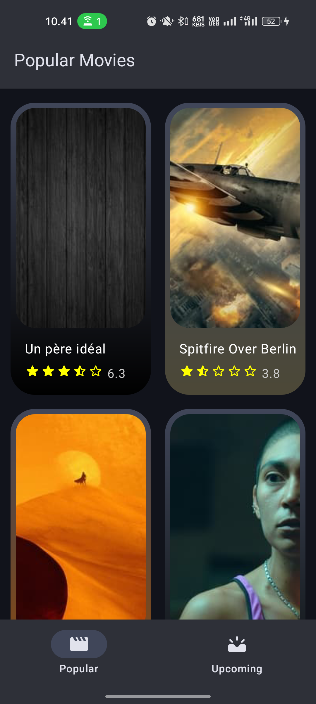
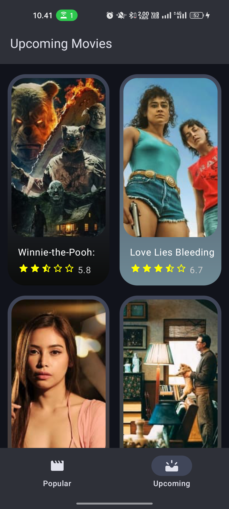
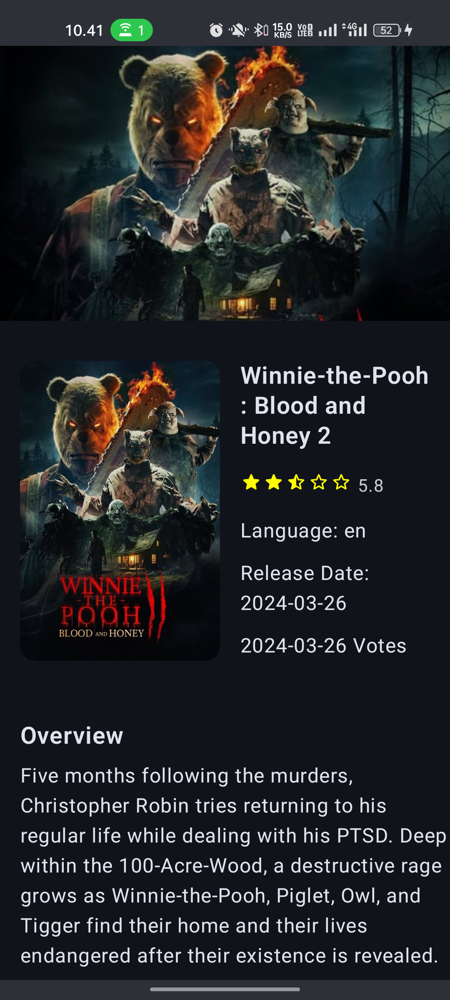

# Movies App: a simple app with MVVM

This application displays a list of popular and upcoming movies from API.

| Project Name                 | Movies App                     |
|------------------------------|--------------------------------|
| Target & Minimum Target SDK  | Phone and Tablet, API level 24 |
| Activity Type                | Empty Activity                 |
| Language                     | Kotlin                         |
| Build Configuration Language | Kotlin DSL                     |

